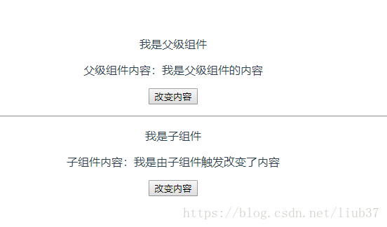

# 基础知识点的掌握

## 关于 HTML+CSS

### HTML 语义化

> 语义化标签、利于页面内容结构化、利于无 CSS 页面可读、利于 SEO、利于代码可读 标准回答 HTML 语义化就是指在使用 HTML 标签构建页面时，避免大篇幅的使用无语义的标签

### CSS 实现垂直水平居中

```html
<div class="wrapper">
  <div class="content"></div>
</div>
```

```css
.wrapper {
  position: relative;
  width: 500px;
  height: 500px;
  border: 1px solid red;
}
.content {
  position: absolute;
  width: 200px;
  height: 200px;
  /*top、bottom、left和right 均设置为0*/
  top: 0;
  bottom: 0;
  left: 0;
  right: 0;
  /*margin设置为auto*/
  margin: auto;
  border: 1px solid green;
}
/* 或者 */
.wrapper {
  display: flex;
  justify-content: center;
  align-items: center;
  width: 500px;
  height: 500px;
  border: 1px solid red;
}
```

### 说一说样式优先级的规则是什么？

- 得分点：

  - `!important`、行内样式、嵌入样式、外链样式、id 选择器、类选择器、标签选择器、复合选择器、通配符、继承样式

- 标准回答：

  - CSS 样式的优先级应该分成四大类

    1. 第一类`!important`，无论引入方式是什么，选择器是什么，它的优先级都是最高的。

    2. 第二类引入方式，行内样式的优先级要高于嵌入和外链，嵌入和外链如果使用的选择器相同就看他们在页面中插入的顺序，在后面插入的会覆盖前面的。

    3. 第三类选择器，选择器优先级：id 选择器>（类选择器 | 伪类选择器 | 属性选择器 ）> （后代选择器 | 伪元素选择器 ）> （子选择器 | 相邻选择器） > 通配符选择器 。

    4. 第四类继承样式，是所有样式中优先级比较低的。

    5. 第五类浏览器默认样式优先级最低。

- 加分回答：

  - 使用!important 要谨慎

  - 一定要优先考虑使用样式规则的优先级来解决问题而不是 `!important`

  - 只有在需要覆盖全站或外部 CSS 的特定页面中使用 `!important`

  - 永远不要在你的插件中使用 `!important`

  - 永远不要在全站范围的 CSS 代码中使用 `!important` 优先级的比较指的是相同的样式属性，不同样式属性优先级比较失效，比如：在设置`max-width`时注意，已经给元素的`max-width`设置了`!important`但是还不生效，很有可能就是被 width 覆盖了

  ```css
  举例：`div`最终的宽度还是`200px` div {
    max-width: 400px !important;
    height: 200px;
    background-color: tomato;
    width: 200px;
  }
  ```

### 关于浮动

- 得分点：

  - 脱离文档流、盒子塌陷、影响其他元素排版、伪元素、overflow：hidden、标签插入法

- 标准回答：

  - 浮动的作用，设置浮动的图片，可以实现文字环绕图片，设置了浮动的块级元素可以排列在同一行，设置了浮动的块级元素可以设置宽高，同时可以按照浮动设置的方向对齐排列盒子

- 设置浮动元素的特点：

  - 设置了浮动，该元素脱标。元素不占位置

  - 浮动可以进行模式转换（行内块元素）浮动造成的影响，使盒子脱离文档流，如果父级盒子没有设置高度，需要被子盒子撑开，那么这时候父级盒子的高度就塌陷了，同时也会造成父级盒子后面的兄弟盒子布局受到影响。如何浮动元素后面还有其他兄弟元素，其他兄弟元素的布局也会受到影响。

- 清除浮动的方法：

  - 伪元素清除浮动：给浮动元素父级增加`overflow：hidden`属性
    ```css
    .clearfix::after {
      content: "";
      display: table;
      clear: both;
    } /*兼容IE低版本 */
    .clearfix {
      *zoom: 1;
      overflow: hidden;
    }
    ```
  - 额外标签法：给浮动元素父级增加标签

- 加分回答：
- 种清除浮动的特点和影响 -伪元素清除浮动：不会新增标签，不会有其他影响，是当下清除浮动最流行的方法 `overflow：hidden`：不会新增标签，但是如果父级元素有定位元素超出父级，超出部分会隐藏，在不涉及父级元素有超出内容的情况，overflow：hidden 比较常用，毕竟写法方便简洁 -标签插入法：清除浮动的语法加在新增标签上，由于新增标签会造成不必要的渲染，所以这种方法目前不建议使用

### 说一说 BFC

- 得分点：

  - 块级格式化上下文、独立的渲染区域、不会影响边界以外的元素、形成 BFC 条件、float、position、
    overflow、display

- 标准回答:

  - BFC(Block Formatting Context)块级格式化上下文，是 Web 页面一块独立的渲染区域，内部元素的渲染不会影响边界以外的元素。

  - BFC 布局规则 -内部盒子会在垂直方向，一个接一个地放置。 -Box 垂直方向的距离由 margin 决定。属于同一个 BFC 的两个相邻 Box 的 margin 会发生重叠。 -每个盒子（块盒与行盒）的 margin box 的左边，与包含块 border box 的左边相接触(对于从左往右的格式化，否则相反)。即使存在浮动也是如此。 -BFC 的区域不会与 float box 重叠。 -BFC 就是页面上的一个隔离的独立容器，容器里面的子元素不会影响到外面的元素。反之也如此。 -计算 BFC 的高度时，浮动元素也参与计算。

  - BFC 形成的条件：`float `设置成 `left `或 `right` - `position `是 `absolute` 或者 `fixed` -`overflow ` 不是 `visible`，为 `auto`、`scroll`、`hidden` -`display` 是 `flex` 或者 `inline-block` 等 BFC 解决能的问题：清除浮动

- 加分回答:

  - BFC 的方式都能清除浮动，但是常使用的清除浮动的 BFC 方式只有`overflow:hidden`,原因是使用 float 或者 position 方式清除浮动，虽然父级盒子内部浮动被清除了，但是父级本身又脱离文档流了，会对父级后面的兄弟盒子的布局造成影响。如果设置父级为`display:flex`，内部的浮动就会失效。所以通常只是用`overflow: hidden`清除浮动。
  - IFC（Inline formatting contexts）：内联格式上下文。IFC 的高度由其包含行内元素中最高的实际高度计算而来（不受到竖直方向的 padding/margin 影响)，IFC 中的 line box 一般左右都贴紧整个 IFC，但是会因为 float 元素而扰乱。
  - GFC（GrideLayout formatting contexts）：网格布局格式化上下文。当为一个元素设置 display 值为 grid 的时候，此元素将会获得一个独立的渲染区域。
  - FFC（Flex formatting contexts）：自适应格式上下文。display 值为 flex 或者 inline-flex 的元素将会生成自适应容器。

## AJAX

### 定义和用法:

AJAX = Asynchronous JavaScript and XML（异步的 JavaScript 和 XML）。Ajax 是一种用于创建快速动态网页的技术。Ajax 是一种在无需重新加载整个网页的情况下，能够更新部分网页的技术。

```js
function CreateXmlHttp() {
  //创建XmlHttpRequest对象
  if (window.XmlHttpRequest) {
    xmlhttp = new XmlHttpRequest();
  }
}

function Ustbwuyi() {
  var data = document.getElementById("username").value;
  CreateXmlHttp();
  if (!xmlhttp) {
    alert("创建xmlhttp对象异常！");
    return false;
  }

  xmlhttp.open("POST", url, false);

  xmlhttp.onreadystatechange = function () {
    if (xmlhttp.readyState == 4) {
      document.getElementById("user1").innerHTML = "数据正在加载...";
      if (xmlhttp.status == 200) {
        document.write(xmlhttp.responseText);
      }
    }
  };
  xmlhttp.send();
}
```

### AJAX 的工作原理：

1. 创建 ajax 对象（XMLHttpRequest/ActiveXObject(Microsoft.XMLHttp)）

2. 判断数据传输方式(GET/POST)

3. 打开链接 open()

4. 发送 send()

5. 当 ajax 对象完成第四步（onreadystatechange）数据接收完成，判断 http 响应状态（status）200-300 之间或者 304（缓存）执行回调函数

### 同步 or 异步

- 所有任务可以分成两种，一种是同步任务（synchronous），另一种是异步任务（asynchronous）。同步任务指的是，在主线程上排队执行的任务，只有前一个任务执行完毕，才能执行后一个任务；异步任务指的是，不进入主线程、而进入"任务队列"（task queue）的任务，只有"任务队列"通知主线程，某个异步任务可以执行了，该任务才会进入主线程执行。

### 说一说 JS 实现异步的方法

- 得分点：
  - 回调函数、事件监听、setTimeOut、Promise、生成器 Generators/yieId、async/await
- 标准回答：
  - 所有异步任务都是在同步任务执行结束之后，从任务队列中依次取出执行。 回调函数是异步操作最基本的方法。
  - 比如 AJAX 回调，回调函数的优点是简单、容易理解和实现，缺点是不利于代码的阅读和维护，各个部分之间高度耦合，使得程序结构混乱、流程难以追踪（尤其是多个回调函数嵌套的情况），而且每个任务只能指定一个回调函数。此外它不能使用 try catch 捕获错误，不能直接 return Promise 包装了一个异步调用并生成一个 Promise 实例，当异步调用返回的时候根据调用的结果分别调用实例化时传入的 resolve 和 reject 方法，then 接收到对应的数据，做出相应的处理。
  - Promise 不仅能够捕获错误，而且也很好地解决了回调地狱的问题，缺点是无法取消 Promise，错误需要通过回调函数捕获
  - Generator 函数是 ES6 提供的一种异步编程解决方案，Generator 函数是一个状态机，封装了多个内部状态，可暂停函数, yield 可暂停，next 方法可启动，每次返回的是 yield 后的表达式结果。优点是异步语义清晰，缺点是手动迭代`Generator` 函数很麻烦，实现逻辑有点绕
  - async/await 是基于 Promise 实现的，async/await 使得异步代码看起来像同步代码，所以优点是，使用方法清晰明了，缺点是 awt 将异步代码改造成了同步代码，如果多个异步代码没有依赖性却使用了 awt 会导致性能上的降低，代码没有依赖性的话，完全可以使用 Promise.all 的方式。
- 加分回答：
  - JS 异步编程进化史：callback -> promise -> generator/yield -> async/await
  - async/await 函数对 Generator 函数的改进，体现在以下三点：
    1. 内置执行器。 Generator 函数的执行必须靠执行器，而 async 函数自带执行器。也就是说，async 函数的执行，与普通函数一模一样，只要一行。
    2. 更广的适用性。 yield 命令后面只能是 Thunk 函数或 Promise 对象，而 async 函数的 awt 命令后面，可以跟 Promise 对象和原始类型的值（数值、字符串和布尔值，但这时等同于同步操作）。
    3. 更好的语义。 async 和 await，比起星号和 yield，语义更清楚了。async 表示函数里有异步操作，await 表示紧跟在后面的表达式需要等待结果。 目前使用很广泛的就是 promise 和 async/await

### JS 中的异步操作有哪些

1. 定时器都是异步操作
2. 事件绑定都是异步操作
3. ajax 中我们一般都是采用异步操作
4. 回调函数可以理解为异步

## web 前端开发，如何提高页面性能优化？

### 内容方面：

1. 减少 HTTP 请求 (Make Fewer HTTP Requests)

2. 减少 DOM 元素数量 (Reduce the Number of DOM Elements)

3. 使得 Ajax 可缓存 (Make Ajax Cacheable)

### 针对 CSS：

1.把 CSS 放到代码页上端 (Put Stylesheets at the Top)

2.从页面中剥离 JavaScript 与 CSS (Make JavaScript and CSS External)

3.精简 JavaScript 与 CSS (Minify JavaScript and CSS)

4.避免 CSS 表达式 (Avoid CSS Expressions)

### 针对 JavaScript：

1. 脚本放到 HTML 代码页底部 (Put Scripts at the Bottom)

2. 从页面中剥离 JavaScript 与 CSS (Make JavaScript and CSS External)

3. 精简 JavaScript 与 CSS (Minify JavaScript and CSS)

4. 移除重复脚本 (Remove Duplicate Scripts)

### 面向图片(Image)：

1. 优化图片

2. 不要在 HTML 中使用缩放图片

3. 使用恰当的图片格式

4. 使用 CSS Sprites 技巧对图片优化

## 关于 ES6、ES7、ES8

### ES6 的新特性你了解哪些?

1. 新增声明命令 let 和 const

- 关于 let：

  - let 声明的变量只在它所在的代码块有效；
  - let 不允许在相同作用域内，重复声明同一个变量。

- 关于 const:
  - const 声明一个只读的常量。一旦声明，常量的值就不能改变。

2. 模板字符串

- 模块化
  - 模块化的功能主要由 export 和 import 组成。每一个模块都有自己单独的作用域，模块之间的相互调用关系是通过 export 来规定模块对外暴露的接口，通过 import 来引用其它模块提供的接口。同时还为模块创造了命名空间，防止函数的命名冲突。

3. 函数的默认参数、箭头函数

4. import 和 export

5. Promise 对象：异步编程的一种解决方案，一般是用来解决回调狱函数

- 所谓 Promise，简单说就是一个容器，里面保存着某个未来才会结束的事件（通常是一个异步操作）的结果。

- Promise 对象有以下两个特点:

  - 对象的状态不受外界影响。Promise 对象代表一个异步操作，有三种状态：pending（进行中）、fulfilled（已成功）和 rejected（已失败）。只有异步操作的结果，可以决定当前是哪一种状态，任何其他操作都无法改变这个状态。
  - 一旦状态改变，就不会再变，任何时候都可以得到这个结果。Promise 对象的状态改变，只有两种可能：从 pending 变为 fulfilled 和从 pending 变为 rejected。只要这两种情况发生，状态就凝固了，不会再变了，会一直保持这个结果，这时就称为 resolved（已定型）。

- 基本用法：

```js
const promise = new Promise(function(resolve, reject) {
 // ... some code

 if (/* 异步操作成功 */){
   resolve(value);
 } else {
   reject(error);
 }
});
```

- Promise 构造函数接受一个函数作为参数，该函数的两个参数分别是 resolve 和 reject。它们是两个函数，由 JavaScript 引擎提供，不用自己部署。

- resolve 函数的作用是，将 Promise 对象的状态从“未完成”变为“成功”（即从 pending 变为 resolved），在异步操作成功时调用，并将异步操作的结果，作为参数传递出去；reject 函数的作用是，将 Promise 对象的状态从“未完成”变为“失败”（即从 pending 变为 rejected），在异步操作失败时调用，并将异步操作报出的错误，作为参数传递出去。

- Promise 实例生成以后，可以用 then 方法分别指定 resolved 状态和 rejected 状态的回调函数。

- 数组的扩展运算符

  - 扩展运算符（spread）是三个点（...）。它好比 rest 参数的逆运算，将一个数组转为用逗号分隔的参数序列。

### 关于 ES7 你了解多少

- Array.prototype.includes()方法
  ```
    ['a', 'b', 'c'].includes('a')     // true
    ['a', 'b', 'c'].includes('d')     // false
  ```
- 求幂运算符（\*\*）

  ```js
  3 ** 2; // 9
  ```

### 关于 ES8 你了解多少

- 异步函数(Async/await)

  - 函数前面的 async 一词意味着一个简单的事情：这个函数总是返回一个 promise，如果代码中有 return <非 promise>语句，JavaScript 会自动把返回的这个 value 值包装成 promise 的 resolved 值。
  - await 只能在 async 函数内部使用，可以让 JavaScript 进行等待，直到一个 promise 执行并返回它的结果，JavaScript 才会继续往下执行

  ```js
  async function showAvatar() {
    // read our JSON
    let response = await fetch("/article/promise-chaining/user.json");
    let user = await response.json();

    // read github user
    let githubResponse = await fetch(
      `https://api.github.com/users/${user.name}`
    );
    let githubUser = await githubResponse.json();

    // 展示头像
    let img = document.createElement("img");
    img.src = githubUser.avatar_url;
    img.className = "promise-avatar-example";
    documenmt.body.append(img);

    // 等待3s
    await new Promise((resolve, reject) => {
      setTimeout(resolve, 3000);
    });

    img.remove();

    return githubUser;
  }
  showAvatar();
  ```

- Object.entries()和 Object.values()

  - Object.entries()

    > 如果一个对象是具有键值对的数据结构，则每一个键值对都将会编译成一个具有两个元素的数组，这些数组最终会放到一个数组中，返回一个二维数组,若目标对象是数组时，则会将数组的下标作为键值返回

    ```js
    Object.entries({ one: 1, two: 2 }); //[['one', 1], ['two', 2]]
    Object.entries([1, 2]); //[['0', 1], ['1', 2]]
    ```

  - Object.values()
    > 它的工作原理跟 Object.entries()很像，顾名思义，它只返回自己的键值对中属性的值。它返回的数组顺序，也跟 Object.entries()保持一致。
    ```js
    Object.values({ one: 1, two: 2 }); //[1, 2]
    Object.values({ 3: "a", 4: "b", 1: "c" }); //['c', 'a', 'b']
    ```

### 说一说 es6 中的箭头函数

- 得分点：

  - 没有 this、this 是从外部获取、不能使用 new、没有 arguments、没有原型和 super -标准回答

  - 箭头函数相当于匿名函数，简化了函数的定义。

  - 箭头函数有两种写法，当函数体是单条语句的时候可以省略{}和 return。另一个是包含多条语句，不可以省略{}和 return。

  - 箭头函数最大的特点就是没有 this，所以 this 是从外部获取，就是继承外部的执行上下文中的 this，由于没有 this 关键字所以箭头函数也不能作为构造函数，同时通过 `call()` 或 `apply()` 方法调用一个函数时，只能传递参数（不能绑定 this），第一个参数会被忽略。

  - 箭头函数也没有原型和 super。不能使用 yield 关键字，因此箭头函数不能用作 Generator 函数。不能返回直接对象字面量。

- 加分回答：

  - 箭头函数的不适用场景：
    - 定义对象上的方法 当调用 `dog.jumps` 时，`lives` 并没有递减。因为 `this` 没有绑定值，而继承父级作用域。
      ```js
      var dog = {
        lives: 20,
        jumps: () => {
          this.lives--;
        },
      };
      ```
    - 不适合做事件处理程序 此时触发点击事件，this 不是 button，无法进行 class 切换
      ```js
      var button = document.querySelector("button");
      button.addEventListener("click", () => {
        this.classList.toggle("on");
      });
      ```
  - 箭头函数函数适用场景：
    - 简单的函数表达式，内部没有 this 引用，没有递归、事件绑定、解绑定，适用于 map、filter 等方法中，写法简洁
      ```js
      var arr = [1,2,3];
      var newArr = arr.map((num)=>num\*num)
      ```
    - 内层函数表达式，需要调用 this，且 this 应与外层函数一致时
      ```js
      let group = {
        title: "Our Group",
        students: ["John", "Pete", "Alice"],
        showList() {
          this.students.forEach((student) =>
            alert(this.title + ": " + student)
          );
        },
      };
      group.showList();
      ```

### 说一说 promise 是什么与使用方法？

- 得分点：
  - pendding、rejected、resolved、微任务、then、catch、Promise.resolve()、Promise.reject()、Promise.all() Promise.any()、Promise.race()
- 标准回答：

  - Promise 的作用：Promise 是异步微任务，解决了异步多层嵌套回调的问题，让代码的可读性更高，更容易维护
  - Promise 使用：Promise 是 ES6 提供的一个构造函数，可以使用 Promise 构造函数 new 一个实例，Promise 构造函数接收一个函数作为参数，这个函数有两个参数，分别是两个函数 `resolve`和`reject`，`resolve`将 Promise 的状态由等待变为成功，将异步操作的结果作为参数传递过去；`reject`则将状态由等待转变为失败，在异步操作失败时调用，将异步操作报出的错误作为参数传递过去。

    实例创建完成后，可以使用`then`方法分别指定成功或失败的回调函数，也可以使用 catch 捕获失败，then 和 catch 最终返回的也是一个 Promise，所以可以链式调用。

  - Promise 的特点：

    1. 对象的状态不受外界影响（Promise 对象代表一个异步操作，有三种状态）。 - pending（执行中） - Resolved（成功，又称 Fulfilled） - rejected（拒绝） 其中 pending 为初始状态，fulfilled 和 rejected 为结束状态（结束状态表示 promise 的生命周期已结束）。

    2. 一旦状态改变，就不会再变，任何时候都可以得到这个结果。 Promise 对象的状态改变，只有两种可能（状态凝固了，就不会再变了，会一直保持这个结果）： - 从 Pending 变为 Resolved - 从 Pending 变为 Rejected

    3. resolve 方法的参数是 then 中回调函数的参数，reject 方法中的参数是 catch 中的参数

    4. then 方法和 catch 方法 只要不报错，返回的都是一个 fullfilled 状态的 promise

- 加分回答：

  - Promise 的其他方法：

    - Promise.resolve() :返回的 Promise 对象状态为 fulfilled，并且将该 value 传递给对应的 then 方法。

    - Promise.reject()：返回一个状态为失败的 Promise 对象，并将给定的失败信息传递给对应的处理方法。

    - Promise.all()：返回一个新的 promise 对象，该 promise 对象在参数对象里所有的 promise 对象都成功的时候才会触发成功，一旦有任何一个 iterable 里面的 promise 对象失败则立即触发该 promise 对象的失败。

    - Promise.any()：接收一个 Promise 对象的集合，当其中的一个 promise 成功，就返回那个成功的 promise 的值。

    - Promise.race()：当参数里的任意一个子 promise 被成功或失败后，父 promise 马上也会用子 promise 的成功返回值或失败详情作为参数调用父 promise 绑定的相应句柄，并返回该 promise 对象。

### 说一说 Cookie、SessionStorage、LocalStorage 的区别

- 得分点：

  > 数据储存位置、生命周期、储存大小、写入方式、数据共享、发送请求时是否携带、应用场景

- 标准回答：

  1. Cookie、SessinStorage、LocalStorage 都是浏览器内部存储。
  2. 他们的共同点：都是存储在浏览器内部的。
  3. 他们的区别： Cookie 是由服务端写入的而 SessionStorage、LocalStorage 都是由前端写入的，Cookie 的生命周期是由服务端再写入的时候就设置好的，LocalStorage 是写入就一直存在，除非手动清除，SessionStorage 是页面关闭的时候就会自动清除。
     Cookie 的存储空间比较小大概 4KB，SessionStorage、 LocalStorage 存储空间比较大，大概 5M。Cookie、SessionStorage、 LocalStorage 数据共享都遵循同源原则，SessionStorage 还限制必须是同一个页面。在前端给后端发送请求的时候会自动携带 Cookie 中的数据，但是 SessionStorage、 LocalStorage 不会

- 加分回答

  > 由于它们的以上区别，所以它们的应用场景也不同，Cookie 一般用于存储登录验证信息 SessionID 或者 token，LocalStorage 常用于存储不易变动的数据，减轻服务器的压力，SessionStorage 可以用来检测用户是否是刷新进入页面，如音乐播放器恢复播放进度条的功能。

## 函数的闭包以及递归

### 闭包

- 在函数中闭包的定义很简单：函数 A 返回了一个函数 B，并且函数 B 中使用了函数 A 的变量，函数 B 就被称为闭包。

  ```js
  function A() {
    let a = 1;
    function B() {
      console.log(a);
    }
    return B;
  }
  ```

- 对闭包的理解

  ```
  得分点:

    变量背包、作用域链、局部变量不销毁、函数体外访问函数的内部变量、内存泄漏、内存溢出、形成块级作用域、柯里化、构造函数中定义特权方法、Vue中数据响应式Observer。

  标准回答:

    闭包一个函数和词法环境的引用捆绑在一起，这样的组合就是闭包（closure）。

    一般就是一个函数A，return其内部的函数B，被return出去的B函数能够在外部访问A函数内部的变量，这时候就形成了一个B函数的变量背包，A函数执行结束后这个变量背包也不会被销毁，并且这个变量背包在A函数外部只能通过B函数访问。

    闭包形成的原理：作用域链，当前作用域可以访问上级作用域中的变量。

    闭包解决的问题：能够让函数作用域中的变量在函数执行结束之后不被销毁，同时也能在函数外部可以访问函数内部的局部变量。

    闭包带来的问题：由于垃圾回收器不会将闭包中变量销毁，于是就造成了内存泄露，内存泄露积累多了就容易导致内存溢出。

  加分回答：

    闭包的应用，能够模仿块级作用域，能够实现柯里化，在构造函数中定义特权方法、Vue中数据响应式Observer中使用闭包等。
  ```

### 递归

- 如果一个函数在内部调用自身本身，这个函数就是递归函数。

  ```js
  function fact(n){
  if (n === 1){
    return 1
  }else{
    return n * fact(n - 1)
  }
  ```

## JS 数据类型以及判断类型数据

### JS 数据类型

- 得分点：
  > Number、String、Boolean、BigInt、Symbol、Null、Undefined、Object、8 种
- 标准回答：

  - JS 数据类型分为两类：一类是基本数据类型，也叫简单数据类型，包含 7 种类型，分别是 Number 、String、Boolean、BigInt、Symbol、Null、Undefined。另一类是引用数据类型也叫复杂数据类型，通常用 Object 代表，普通对象，数组，正则，日期，Math 数学函数都属于 Object。

  - 数据分成两大类的本质区别：基本数据类型和引用数据类型它们在内存中的存储方式不同。基本数据类型是直接存储在栈中的简单数据段，占据空间小，属于被频繁使用的数据。引用数据类型是存储在堆内存中，占据空间大。引用数据类型在栈中存储了指针，该指针指向堆中该实体的起始地址，当解释器寻找引用值时，会检索其在栈中的地址，取得地址后从堆中获得实体。

- 加分回答：

  - Symbol 是 ES6 新出的一种数据类型，这种数据类型的特点就是没有重复的数据，可以作为 object 的 key。

  - 数据的创建方法 Symbol()，因为它的构造函数不够完整，所以不能使用 new Symbol()创建数据。由于 Symbol()创建数据具有唯一性，所以 Symbol() !== Symbol(), 同时使用 Symbol 数据作为 key 不能使用 for 获取到这个 key，需要使用 Object.getOwnPropertySymbols(obj)获得这个 obj 对象中 key 类型是 Symbol 的 key 值。

    ```js
    let key = Symbol("key");
    let obj = { [key]: "symbol" };
    let keyArray = Object.getOwnPropertySymbols(obj); // 返回一个数组[Symbol('key')]
    obj[keyArray[0]]; // 'symbol'
    ```

  - BigInt 也是 ES6 新出的一种数据类型，这种数据类型的特点就是数据涵盖的范围大，能够解决超出普通数据类型范围报错的问题。

    ```
    使用方法：
      整数末尾直接+n：647326483767797n
      调用BigInt()构造函数：BigInt("647326483767797")
      注意：BigInt和Number之间不能进行混合操作
    ```

### 判断类型数据

- JavaScript 有 4 种方法判断变量的类型，分别是 typeof、instanceof、Object.prototype.toString.call()（对象原型链判断方法）、 constructor (用于引用数据类型)

  1. typeof：常用于判断基本数据类型，对于引用数据类型除了 function 返回’function‘，其余全部返回’object'。

  2. instanceof：主要用于区分引用数据类型，检测方法是检测的类型在当前实例的原型链上，用其检测出来的结果都是 true，不太适合用于简单数据类型的检测，检测过程繁琐且对于简单数据类型中的 undefined, null, symbol 检测不出来。

  3. constructor：用于检测引用数据类型，检测方法是获取实例的构造函数判断和某个类是否相同，如果相同就说明该数据是符合那个数据类型的，这种方法不会把原型链上的其他类也加入进来，避免了原型链的干扰。

  4. Object.prototype.toString.call()：适用于所有类型的判断检测，检测方法是 Object.prototype.toString.call(数据) 返回的是该数据类型的字符串。

- 这四种判断数据类型的方法中，各种数据类型都能检测且检测精准的就是 Object.prototype.toString.call()这种方法。

> instanceof 的实现原理：验证当前类的原型 prototype 是否会出现在实例的原型链**proto**上，只要在它的原型链上，则结果都为 true。因此，`instanceof` 在查找的过程中会遍历左边变量的原型链，直到找到右边变量的 `prototype`，找到返回 true，未找到返回 false。

> Object.prototype.toString.call()原理：Object.prototype.toString 表示一个返回对象类型的字符串，call()方法可以改变 this 的指向，那么把 Object.prototype.toString()方法指向不同的数据类型上面，返回不同的结果

### null 和 undefined 的区别，如何让一个属性变为 null

> 操作的变量没有被赋值、全局对象的一个属性、函数没有 return 返回值、值'null'特指对象的值未设置 undefined == null、undefined !== null

- 标准回答：

  - undefined 是全局对象的一个属性，当一个变量没有被赋值或者一个函数没有返回值或者某个对象不存在某个属性却去访问或者函数定义了形参但没有传递实参，这时候都是 undefined。

  - undefined 通过 typeof 判断类型是'undefined'。undefined == undefined undefined === undefined。

  - null 代表对象的值未设置，相当于一个对象没有设置指针地址就是 null。null 通过 typeof 判断类型是'object'。null == null null === null null == undefined null !== undefined。 undefined 表示一个变量的初始状态值，而 null 则表示一个变量被人为的设置为空对象，而不是原始状态。在实际使用过程中，不需要对一个变量显式的赋值 undefined，当需要释放一个对象时，直接赋值为 null 即可。让一个变量为 null，直接给该变量赋值为 null 即可。

- 加分回答：

  - null 其实属于自己的类型 null，而不属于 Object 类型，typeof 之所以会判断为 Object 类型，是因为 JavaScript 数据类型在底层都是以二进制的形式表示的，二进制的前三位为 0 会被 typeof 判断为对象类型，而 null 的二进制为恰好都是 0，因此，null 会被误判断为 Object 类型。对象被赋值了 null 以后，对象对应的堆内存中的值就是游离状态了，GC 会择机回收该值并释放内存。因此，需要释放某个对象，就将变量设置为 null，即表示该对象已经被清空，目前无效状态。

## 说一说数组去重都有哪些方法

- 得分点：

  - 对象属性、new Set()、indexOf、hasOwnProperty、reduce+includes、filter

- 标准答案：

  - 第一种方法：利用对象属性 key 排除重复项：遍历数组，每次判断对象中是否存在该属性，不存在就存储在新数组中，并且把数组元素作为 key，设置一个值，存储在对象中，最后返回新数组。这个方法的优点是效率较高，缺点是占用了较多空间，使用的额外空间有一个查询对象和一个新的数组
  - 第二种方法：利用 Set 类型数据无重复项：new 一个 Set，参数为需要去重的数组，Set 会自动删除重复的元素，再将 Set 转为数组返回。这个方法的优点是效率更高，代码简单，思路清晰，缺点是可能会有兼容性问题
  - 第三种方法：filter+indexOf 去重：这个方法和第一种方法类似，利用 Array 自带的 filter 方法，返回 arr.indexOf(num)等于 index 的 num。原理就是 indexOf 会返回最先找到的数字索引，假设数组是[1,1],在对第二个 1 使用 indexOf 方法时，返回的是第一个 1 的索引 0.这个方法的优点是可以在去重的时候插入队元素的操作，可拓展性强。
  - 第四种方法：这个方法比较巧妙，从头遍历数组，如果元素在前面出现过，则将当前元素挪到最后面，继续遍历，直到遍历完所有元素，之后将那些被挪到最后的元素抛弃。这个方法因为是直接操作数组，占用内存比较少
  - 第五种方法：reduce+includes 去重：这个方法就是利用 reduce 遍历和传入一个空数组作为去重后的新数组，然后内部判断新数组中是否存在当前遍历的元素，不存在就插入到新数组中。这种方法时间消耗多，内部空间也有额外占用。方法还有很多，常用的，了解的这些就可以

- 加分回答

  - 以上五种方法中，在数据低于 10000 条的时候没有明显的差别，高于 10000 条，第一种和第二种的时间消耗最少，后面三种时间消耗依次增加，由于第一种内存空间消耗比较多，且现在很多项目不在考虑低版本浏览器的兼容性问题，所以建议使用第二种去重方法，简洁方便。

## call apply bind 的作用和区别

- 得分点：

  - bind 改变 this 指向不直接调用、call 和 apply 改变 this 指向直接调用、apply 接收第二个参数为数组 、call 用于对象的继承 、伪数组转换成真数组、apply 用于找出数组中的最大值和最小值以及数组合并、bind 用于 vue 或者 react 框架中改变函数的 this 指向。

- 标准回答：

  - call、apply、bind 的作用都是改变函数运作时的 this 指向问题。

  - bind 和 call、apply 在使用上有所不同，bind 在改变 this 指向的时候，返回一个改变执行上下文的函数，不会立即执行函数，而是需要调用该函数的时候再调用即可，但是 call 和 apply 在改变 this 指向的同时执行了该函数。

  - bind 只接收一个参数，就是 this 指向的执行上文。call、apply 接收多个参数，但是 call 和 apply 参数的格式不同，call 是一个参数对应一个原函数的参数，但是 apply 第二个参数是数组，数组中每个元素代表函数接收的参数，数组有几个元素函数就接收几个元素

- 加分回答：

  - call 的应用场景：对象的继承，在子构造函数这种调用父构造函数，但是改变 this 指向，就可以继承父的属性

    ```js
    function superClass() {
      this.a = 1;
      this.print = function () {
        console.log(this.a);
      };
    }

    function subClass() {
      superClass.call(this); // 执行superClass，并将superClass方法中的this指向subClass this.print();
    }
    subClass();
    ```

  - 借用 Array 原型链上的 slice 方法，把伪数组转换成真数组

    ```js
    let domNodes = Array.prototype.slice.call(
      document.getElementsByTagName("div")
    );
    ```

  - apply 的应用场景：Math.max，获取数组中最大，最小的一项

    ```js
    let max = Math.max.apply(null, array);
    let min = Math.min.apply(null, array);
    //实现两个数组合并
    let arr1 = [1, 2, 3];
    let arr2 = [4, 5, 6];
    Array.prototype.push.apply(arr1, arr2);
    console.log(arr1); // [1, 2, 3, 4, 5, 6]
    ```

  - bind 的应用场景在 vue 或者 react 框架中，使用 bind 将定义的方法中的 this 指向当前类

## 说一说 this 指向（普通函数、箭头函数）

- 得分点：

  - 全局执行上下文、函数执行上下文、this 严格模式下 undefined、非严格模式 window、构造函数新对象本身、普通函数不继承 this、箭头函数无 this，可继承

- 标准回答：

  - this 关键字由来：在对象内部的方法中使用对象内部的属性是一个非常普遍的需求。但是 JavaScript 的作用域机制并不支持这一点，基于这个需求，JavaScript 又搞出来另外一套 this 机制。

  - this 存在的场景有三种全局执行上下文和函数执行上下文和 eval 执行上下文，eval 这种不讨论。

  - 在全局执行环境中无论是否在严格模式下，（在任何函数体外部）`this` 都指向全局对象。

  - 在函数执行上下文中访问 this，函数的调用方式决定了 `this` 的值。

  - 在全局环境中调用一个函数，函数内部的 this 指向的是全局变量 window，通过一个对象来调用其内部的一个方法，该方法的执行上下文中的 this 指向对象本身。

  - 普通函数 this 指向：当函数被正常调用时，在严格模式下，this 值是 undefined，非严格模式下 this 指向的是全局对象 window；通过一个对象来调用其内部的一个方法，该方法的执行上下文中的 this 指向对象本身。

  - new 关键字构建好了一个新对象，并且构造函数中的 this 其实就是新对象本身。嵌套函数中的 this 不会继承外层函数的 this 值。

  - 箭头函数 this 指向：箭头函数并不会创建其自身的执行上下文，所以箭头函数中的 this 取决于它的外部函数。

- 加分回答：

  - 箭头函数因为没有 this，所以也不能作为构造函数，但是需要继承函数外部 this 的时候，使用箭头函数比较方便

    ```js
    var myObj = {
      name: "闷倒驴",
      showThis: function () {
        console.log(this); // myObj
        var bar = () => {
          this.name = "王美丽";
          console.log(this); // myObj
        };
        bar();
      },
    };
    myObj.showThis();
    console.log(myObj.name); // "王美丽"
    console.log(window.name); // ''
    ```

  `剩余待补充...`

# 插件的掌握

## jQuery

> [jQuery API](http://jquery.cuishifeng.cn/)

### （简单的）jQuery 源码分析

```js
(function (window, undefined) {})();
// 一个匿名函数自执行，它的好处在于，可以把代码块中所有的变量都变成局部变量，这样就不会造成对全局变量的一个污染，导致代码冲突

jQuery.fn = jQuery.prototype = {};
// 表明jQuery是一个基于面向对象的程序，往后就是在给jQuery对象添加一些属性和方法。

jQuery.Callbacks = function (options) {};
// 回调对象:通过回调对象统一管理函数

jQuery.extend({ Deferred: function (func) {} });
// Deferred:延迟对象,对异步的统一管理

jQuery.support = function (support) {};
// support:功能检测,无需判断浏览器,通过判断功能检测浏览器版本

jQuery.fn.extend({ queue: function (type, data) {} });
// queue:队列管理,入队 dequeue:出队

$("#div1").animate({ left: 100 });
$("#div1").animate({ top: 100 });
$("#div1").animate({ width: 100 }); //left->top->width 通过队列管理执行顺序
//  这个就是通过queue队列管理实现的顺序进行动画。

jQuery.fn.extend({ attr: function (name, value) {} });
// 其中定义了attr(), prop(),val(),addClass()...方法,对元素属性的操作
```

## BootStrap

> [BootStrap](http://www.bootcss.com)

> 待补充

## Zepto

> [Zepto](https://www.html.cn/doc/zeptojs_api/)

### Zepto 与 jQuery 的区别

- 相同点：

  > Zepto 是 jQuery 的轻量级替代品，它的 API 与 jquery 基本一致，它的体积非常小，jQuery 中常用的 API 和方法，Zepto 基本都有，所以适用于移动端开发。相比于 jQuery Mobile，Zepto 更合适。

- 不同点：

  1. Zepto 不支持 IE 浏览器
  2. DOM 操作的区别
     - 添加 id 时，jQuery 不会生效，Zepto 会生效
  3. 事件触发的区别
     - 使用 jQuery 时 load 事件的处理函数不会执行；使用 Zepto 时 load 事件的处理函数会执行
  4. 事件委托的区别
     - 在 Zepto 中，当 a 被点击后，依次弹出了内容为"a 事件"和"b 事件"，说明虽然事件委托在.a 上可是却也触发了.b 上的委托。但是在 jQuery 中只会触发.a 上面的委托弹出”a 事件“。Zepto 中，document 上所有的 click 委托事件都依次放入到一个队列中，点击的时候先看当前元素是不是.a，符合则执行，然后查看是不是.b，符合则执行。而在 jQuery 中，document 上委托了 2 个 click 事件，点击后通过选择符进行匹配，执行相应元素的委托事件。
  5. click 和 tap 比较

     - 两者都会在点击时触发，但是在手机 WEB 端，click 会有 200~300 ms，所以请用 tap 代替 click 作为点击事件。

## MUI

> [MUI](http://dev.dcloud.net.cn/mui/)

## swiper

> [Swiper](https://www.swiper.com.cn/) 是纯 javascript 打造的滑动特效插件，面向手机、平板电脑等移动终端。

### vue 使用 Swiper

```js
// CDN
<link rel="stylesheet" href="path/to/swiper/dist/css/swiper.css"/>
<script type="text/javascript" src="path/to/swiper.js"></script>
<script type="text/javascript" src="path/to/dist/vue-awesome-swiper.js"></script>
  Vue.use(window.VueAwesomeSwiper)

//项目内全局安装

import Vue from 'vue'
import VueAwesomeSwiper from 'vue-awesome-swiper'

import 'swiper/dist/css/swiper.css'

Vue.use(VueAwesomeSwiper, /* { default global options } */)

// 组件内安装
import 'swiper/dist/css/swiper.css'

import { swiper, swiperSlide } from 'vue-awesome-swiper'

export default {
  components: {
    swiper,
    swiperSlide
  }
}
```

## Sass/Less

[Sass](https://www.sass.hk/) 是一门 CSS 预处理语言,基于 Ruby 语言开发而成

[Less](http://lesscss.cn/) 是一门 CSS 预处理语言

    sass 和 less 都是 css 的预编译处理语言，他们引入了 mixins，参数，嵌套规则，运算，颜色，名字空间，作用域，JavaScript 赋值等 加快了 css 开发效率,当然这两者都可以配合 gulp 和 grunt 等前端构建工具使用

- 变量

  ```css
  @width：100px;
  .box {
    width: @width;
  }
  ```

- 嵌套规则

  ```css
  父级{

      子集
  }
  ```

- 插入文件(sass)

      @import命令插入外部文件 .scss和css都可

- 条件语句(sass)

      //@if 可以用来判断 @else 则是配套

      .box{
          @if 1+1>1 {width:100px;}@else {
              width:200px;
          }
      }

- 循环语句(Sass)

      //@for @while @each
      @for $i from 1 to 10{
          border-#{$i}{
      border:#{\$i}px solid red;
      }
      }

      //@while
      $i:6;
      @while $i>0{
      .item-#{$i}{
              width:2em*$i;
      }
      $i:$i-2;
      }

      //@each
      @each $member in a, b, c, d {
      　.#{$member} {
      　　　background-image: url("/image/#{\$member}.jpg");
      　　}
      }

### Sass/less 的区别

- sass 和 less 都是 css 的预编译处理语言，他们引入了 mixins，参数，嵌套规则，运算，颜色，名字空间，作用域，JavaScript 赋值等 加快了 css 开发效率,当然这两者都可以配合 gulp 和 grunt 等前端构建工具使用

## VUE(2.x)

> [VUE](https://cn.vuejs.org/)

### 什么是深入响应式原理？

- 深入响应式原理是利用了数据劫持和订阅发布的模式, 当数据模型发生改变的时候，
- 视图就会响应的进行更新， 那么深入响应式原理是利用 es5 的 Object.defineProperty 中 getter/setter 来进行数据的劫持的

- Vue 通过 watcher 将 data 中的属性全部使用 Object.definePropery 变成 getter 和 setter,当属性值发生
  改变的时候， 就会触发， 然后 wather 就会触发， 告诉视图（V）进行重新渲染

- 名称解释：

  数据劫持： Object.defineProperty 中的 getter/setter ， 然后在执行 watcher

  订阅发布：事件（自定义事件）

  订阅： 事件的声明 vm.$on    
      发布： 事件的触发  vm.$emit

### 双向绑定的理解

1. 效果

   数据改，视图更

   视图改，数据更

2. 实现

   使用 v-model 实现

3. 缺点

   v-model 默认绑定 value 属性， 所以 v-model 只能在表单使用

4. 原理

   1. 为什么数据能直接在视图显示

      v-model 默认绑定了 DOM 对象的 value 属性， 当它初次绑定的时候，
      就会触发 getter,watcher 就会触发， watcher 通知 Vue 生成新的 VDOM 树，
      再通过 render 函数进行渲染,生成真实 DOM

   2. 为什么视图修改数据就会修改

      当视图修改是， 意味着 DOM 的 value 属性值改变，就会触发 setter,watcher 监听机制就会执行
      watcher 通知 Vue 生成新的 VDOM 树，再通过 render 函数进行渲染,生成真实 DOM

5. 自定义组件的双向绑定

- vue 中父子组件通信，都是单项的，直接在子组件中修改 prop 传的值 vue 也会给出一个警告，接下来就用一个小列子一步一步实现了 vue 自定义的组件实现 v-model 双向绑定，父组件值变了子组件也会跟着变，子组件中传过来的值变了，父组件值也会跟着变化。

  ```html
  //父级组件
  <template>
    <div>
      <p>我是父级组件</p>
      <p>父级组件内容：{{ text }}</p>
      <p><button @click="onChange">改变内容</button></p>
      <hr />
      <child v-model="text"></child>
    </div>
  </template>
  <script>
    import Child from "./child";
    export default {
      components: {
        Child,
      },
      data() {
        return {
          text: "我是父级组件的内容",
        };
      },
      methods: {
        onChange() {
          this.text = "我是由父级组件触发改变了内容";
        },
      },
    };
  </script>
  <style scoped></style>

  // 子组件

  <template>
    <div>
      <p>我是子组件</p>
      <p>子组件内容：{{ value }}</p>
      <p><button @click="onChange">改变内容</button></p>
    </div>
  </template>
  <script>
    export default {
      props: {
        //此处一定要用value
        value: {
          type: String,
        },
      },
      methods: {
        onChange() {
          this.value = "我是由子组件触发改变了内容";
        },
      },
    };
  </script>
  ```

  

### 说一说 Vue2.0 双向绑定的原理与缺陷

- Vue 响应式指的是：组件的 data 发生变化，立刻触发视图的更新

- 原理： Vue 采用数据劫持结合发布者-订阅者模式的方式来实现数据的响应式，通过 Object.defineProperty 来劫持数据的 setter，getter，在数据变动时发布消息给订阅者，订阅者收到消息后进行相应的处理。 通过原生 js 提供的监听数据的 API，当数据发生变化的时候，在回调函数中修改 dom

- 核心 API：Object.defineProperty

  - Object.defineProperty API 的使用

    - 作用: 用来定义对象属性 特点： 默认情况下定义的数据的属性不能修改 描述属性和存取属性不能同时使用，使用会报错

    - 响应式原理： 获取属性值会触发 getter 方法 设置属性值会触发 setter 方法 在 setter 方法中调用修改 dom 的方法

- Object.defineProperty 的缺点

  1. 一次性递归到底开销很大，如果数据很大，大量的递归导致调用栈溢出

  2. 不能监听对象的新增属性和删除属性

  3. 无法正确的监听数组的方法，当监听的下标对应的数据发生改变时

### watch 监听

用来监听数据的变换， 当数据模型 （data 选项 M）发生改变时， watch 就会触发

watch 中的 key 指的就是 data 选项中 key
对比 watch computed methods
methods : 用于时间
watch : 1.异步操作 2. 开销较大
computed : 1. 有逻辑 2. 要像变量一样使用

### mixins

组件即实例， 实例即组件

1. 概念：

mixins 混合, 将根实例或是组件中的配置项抽离出来，单独管理

2. 类型

A：局部混入

注意：

1. 即使分离出去， 我们的配置项中也可以继续写分离出去的配置
2. 如果说分离出去中的内容有冲突， 以组件中的配置项为准 3. 配置项中的方法执行时是最优先的

B: 全局混入

注意：全局混入慎用（不建议你使用）

理由：全局混入会影响所有的组件（实例）

### 生命周期（钩子函数）


- **beforeCreate（创建前）**

- 官方文档: 在实例初始化之后，数据观测 (data observer) 和 event/watcher 事件配置之前被调用。

- **created（创建完）**

- 官方文档: 在实例创建完成后被立即调用。在这一步，实例已完成以下的配置：数据观测 (data observer)，属性和方法的运算，watch/event 事件回调。然而，挂载阶段还没开始，\$el 属性目前不可见。

- **beforeMount（挂载前）**

- 官方文档: 在挂载开始之前被调用：相关的 render 函数首次被调用。

- **mounted（挂载完）**

- 官方文档: el 被新创建的 vm.$el 替换，并挂载到实例上去之后调用该钩子。如果 root 实例挂载了一个文档内元素，当 mounted 被调用时 vm.$el 也在文档内。

- **beforeUpdate（更新前）**

- 官方文档: 数据更新时调用，发生在虚拟 DOM 打补丁之前。这里适合在更新之前访问现有的 DOM，比如手动移除已添加的事件监听器。

- 注: 该钩子在服务器端渲染期间不被调用，因为只有初次渲染会在服务端进行。

- **updated（更新完）**

- 官方文档: 由于数据更改导致的虚拟 DOM 重新渲染和打补丁，在这之后会调用该钩子。

当这个钩子被调用时，组件 DOM 已经更新，所以你现在可以执行依赖于 DOM 的操作。然而在大多数情况下，你应该避免在此期间更改状态。如果要相应状态改变，通常最好使用计算属性或 watcher 取而代之。

- 注: updated 不会承诺所有的子组件也都一起被重绘。如果你希望等到整个视图都重绘完毕，可以用 vm.\$nextTick 替换掉 updated

- **beforeDestroy（销毁前）**

- 官方文档: 实例销毁之前调用。在这一步，实例仍然完全可用。

- 注: 该钩子在服务器端渲染期间不被调用。

- **destroyed（销毁完）**

- 官方文档: Vue 实例销毁后调用。调用后，Vue 实例指示的所有东西都会解绑定，所有的事件监听器会被移除，所有的子实例也会被销毁。

- 注: 该钩子在服务器端渲染期间不被调用。

### Vue Router

使用 Vue.js ，我们已经可以通过组合组件来组成应用程序，当你要把 Vue Router 添加进来，我们需要做的是，将组件 (components) 映射到路由 (routes)，然后告诉 Vue Router 在哪里渲染它们。

> yyz：(自我理解):最终目的是进行组件间的交换，以引用的地址达成交换

- router 的生命周期

  ```js
  module.exports = {
    //props: ['父组建传的值'],
    data: function () {
      lifecycle.push("data");
      return {
        msg: "各个阶段，可以查看控制台输出，message from my-views",
        title: "my_views",
        lifecycle: lifecycle,
      };
    },
    //这里是route的生存周期
    route: {
      //waitForData: true, //  数据加载完毕后再切换试图，也就是 点击之后先没反应，然后数据加载完，再出发过渡效果
      canActivate: function (transition) {
        //  canActivate阶段，可以做一些用户验证的事情(是否可以被激活)
        //  在验证阶段，当一个组件将要被切入的时候被调用。
      },
      activate: function (transition) {
        //  在激活阶段被调用，在 activate 被断定（ resolved ，指该函数返回的 promise 被 resolve ）。用于加载和设置当前组件的数据。(激活)
        //this.$root.$set('header',this.title);
        transition.next();
        //此方法结束后，api会调用afterActivate 方法
        //在aftefActivate中 会给组件添加 $loadingRouteData 属性 并设置为true
      },
      data: function (transition) {
        var _this = this;
        //  在激活阶段被调用，在 activate 被断定（ resolved ，指该函数返回的 promise 被 resolve ）。用于加载和设置当前组件的数据
        // 说明之前请求过 则不用再请求了
        if (this.$root.myViewsData) {
          this.$data = this.$root.myViewsData;
          transition.next();
          console.log("已经请求过了不再请求数据");
          return;
        }

        //将数据同步到根节点
        this.$root.myViewsData = this.$data;
        setTimeout(
          function () {
            //这里 _this.$loadingRouteData 是 true
            transition.next({ msg: "加载后的数据" });
            //在调用完transition.next 后，_this.$loadingRouteData 为 false
          }.bind(this),
          4000
        );
      },
      canDeactivate: function (transition) {
        //  在验证阶段，当一个组件将要被切出的时候被调用。(是否可以被禁用)
      },
      deactivate: function (transition) {
        //  在激活阶段，当一个组件将要被禁用和移除之时被调用。(禁用)
      },
    },
    // 生命周期
    beforeCreate: function () {
      // 在实例初始化之后，数据观测(data observer) 和 event/watcher 事件配置之前被调用。
    },
    created: function () {
      // 实例已经创建完成之后被调用。在这一步，实例已完成以下的配置：数据观测(data observer)，属性和方法的运算， watch/event 事件回调。然而，挂载阶段还没开始，$el 属性目前不可见。
    },
    mounted: function () {
      // el 被新创建的 vm.$el 替换，并挂载到实例上去之后调用该钩子。如果 root 实例挂载了一个文档内元素，当 mounted 被调用时 vm.$el 也在文档内。
    },
    beforeUpdate: function () {
      // 数据更新时调用，发生在虚拟 DOM 重新渲染和打补丁之前。
      // 你可以在这个钩子中进一步地更改状态，这不会触发附加的重渲染过程。
    },
    Update: function () {
      // 由于数据更改导致的虚拟 DOM 重新渲染和打补丁，在这之后会调用该钩子。
      //当这个钩子被调用时，组件 DOM 已经更新，所以你现在可以执行依赖于 DOM 的操作。然而在大多数情况下，你应该避免在此期间更改状态，因为这可能会导致更新无限循环。
    },

    // <keep-alive> 包裹动态组件时，会缓存不活动的组件实例，而不是销毁它们。
    activated: function () {
      // keep-alive 组件激活时调用。
    },
    deactivated: function () {
      // keep-alive 组件停用时调用。
    },

    beforeDestroy: function () {
      // 实例销毁之前调用。在这一步，实例仍然完全可用。
    },
    destroyed: function () {
      // Vue 实例销毁后调用。调用后，Vue 实例指示的所有东西都会解绑定，所有的事件监听器会被移除，所有的子实例也会被销毁。
    },
  };
  ```

## VUEX

state、mutations、getters、actions、module、store.commit、store.dispatch

Vuex 是一个专为 Vue.js 应用程序开发的状态管理模式。它采用集中式存储管理应用的所有组件的状态，并以相应的规则保证状态以一种可预测的方式发生变化。

Vuex 是集中管理项目公共数据的。Vuex 有 state、mutations 、getters、actions、module 属性。

- **State**

  - state 属性用来存储公共管理的数据。

- **Getter**

  - getters 属性可以认为是定义 store 的计算属性。就像计算属性一样，getter 的返回值会根据它的依赖被缓存起来，且只有当它的依赖值发生了改变才会被重新计算。

- **Mutation**

  - mutations 属性定义改变 state 中数据的方法， 注意：不要在 mutation 中的方法中写异步方法 ajax，那样数据就不可跟踪了 。

- **Module**

  - moudle 属性是将 store 分割成模块。每个模块拥有自己的 state、mutation、action、getter、甚至是嵌套子模块，从上至下进行同样方式的分割。

- **Action**

  - action 属性类似于 mutation，不同在于：Action 提交的是 mutation，而不是直接变更状态。Action 可以包含任意异步操作。

- 使用方法：
  - state ：直接以对象方式添加属性
  - mutations ：通过`store.commit`调用
  - action：通过 `store.dispatch` 方法触发
  - getters：直接通过 store.getters.调用

**可以使用 mapState、mapMutations、mapAction、mapGetters 一次性获取每个属性下对应的多个方法。 VueX 在大型项目中比较常用，非关系组件传递数据比较方便。**

## WEBPACK

### [webpack](https://webpack.docschina.org/concepts/)中文文档

### 前面的话

- webpack 是一个模块打包器(module bundler)，处理模块间的依赖关系，并进行打包。

### webpack 基本功能

1. 依赖管理：方便引用第三方模块，让模块更容易复用、避免全局注入导致的冲突、避免重复加载或者加载不必要的模块
2. 合并代码：把各个分散的模块集中打包成大文件，减少 HTTP 的链接的请求次数，配合 uglify.js 可以减少、优化代码的体积
3. 各种插件：babel 把 ES6+转化为 ES5-，eslint 可以检查编译时的各种错误

### webpack 的工作原理

- 简单的说就是分析代码，找到“require”、“exports”、“define”等关键词，并替换成对应模块的引用。
- 在一个配置文件中，指明对某些文件进行编译、压缩、组合等任务。把你的项目当成一个整体，通过一个给定的主文件 （index.js），webpack 将从这个文件开始找到你的项目的所有的依赖文件，使用 loaders 处理他们，最后打包为一个浏览器可以识别的 js 文件。

### 使用 webpack 之前

- 举个例子：index.html 里面有一大堆的 css 和 js 文件，如 a.js b.js c.js 等等

1. a.js 要用到 b.js 里面的一个函数，则 a.js 要放在 b.js 后面

2. c.js 要用到 a.js 里面的一个函数，则 c.js 要放在 a.js 后面

3. b.js 又要用到某个 js 文件里面的函数，则 b.js 就要放在其后面

   如果有 N 多个 js 文件，需要手动处理他们的关系，即容易出错。

### 使用 webpack

    webpack 的理念就是一切皆模块化，把一堆的 css 文件和 js 文件放在一个总的入口文件，通过 require 引入，剩下的事情 webpack 会处理，包括所有模块的前后依赖关系，打包、压缩、合并成一个 js 文件，公共代码抽离成一个 js 文件、某些自己指定的 js 单独打包，模块可以是 css/js/imsge/font 等等。

### 使用场景

    自动处理里面的图片路径，css 里面背景图的路径，字体引用

    根据模板生成 HTML，并自动处理上面的 css/js 引用路径

    开启本地服务器，一边改写代码，一边自动更新页面内容

    编译 jsx es6 sass less coffescript 等，并添加 md5、sourcemap 等辅助

    异步加载内容，不需要时不加载到 DOM

    配合 vue.js react.js 等框架开发

##

```

```
